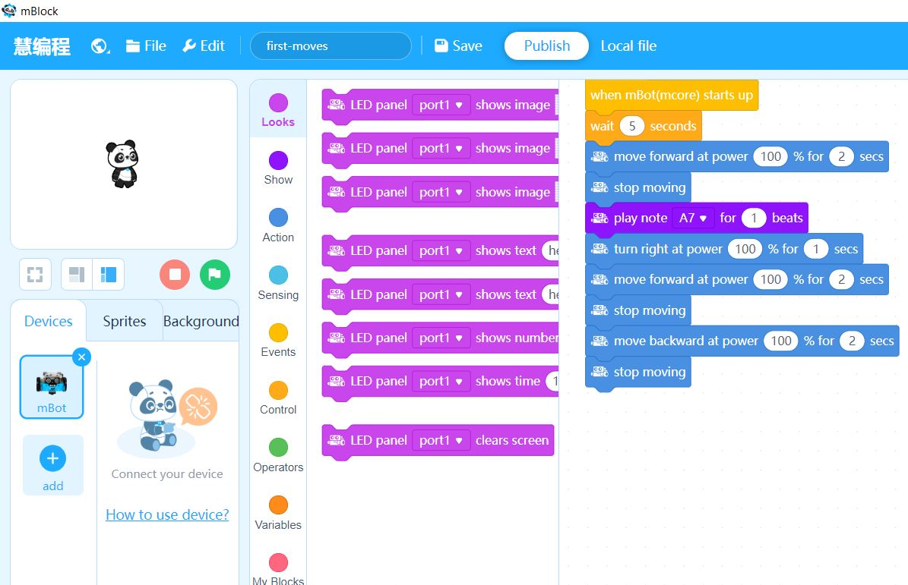
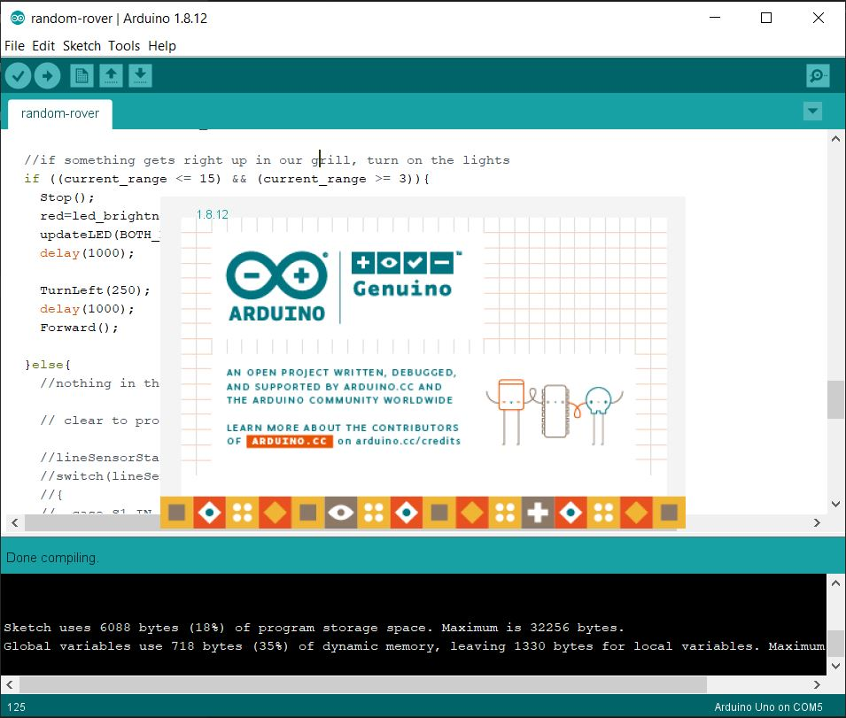

# mBot

A fun side project controlling the MakeBlock mBot robot using Arduino C

**The Goal**

To have some fun

**The Setup**

* mBot starter kit [official website](https://www.makeblock.com/mbot)
* ME LED Matrix [amazon](https://www.amazon.com/Makeblock-Matrix-8%C3%9716-mBot-robot/dp/B01DF3198K)
* Arduino IDE 1.8.12 [arduino.cc](https://www.arduino.cc/en/main/software)
* Makebock Arduino Libraries [github repo](https://github.com/Makeblock-official/Makeblock-Libraries)

At time of creating this repo, the current Arduino IDE was at version 1.8.12  I recommend staying current with the Arduino IDE as much as possible

Follow all instructions related to installing the IDE and libraries

note - MakeBlock offers a drag and drop IDE, pictured here

I prefer the Arduino IDE

